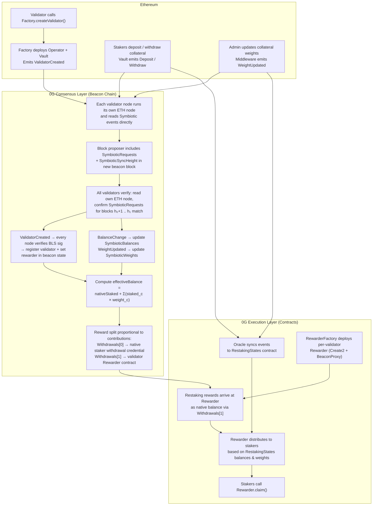
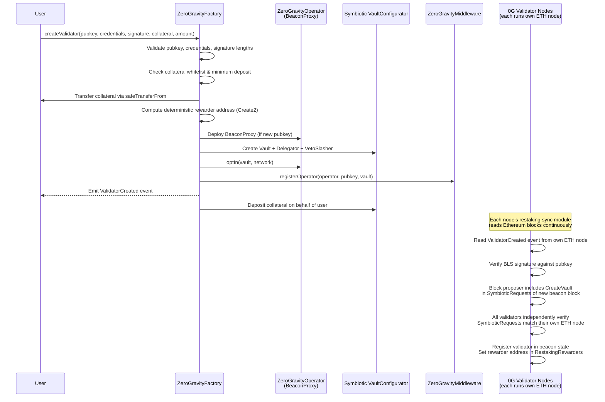

# 0G Restaking Contracts

[](https://docs.soliditylang.org/)
[](https://book.getfoundry.sh/)
[](LICENSE)

**0g-restaking-contracts** is part of the **restaking module** for the 0G Chain.
It is **built on top of the [Symbiotic](https://symbiotic.fi/) protocol**, enabling validators to restake their assets in Symbiotic and participate in 0G Chain consensus.

## Prerequisites

- [Foundry](https://book.getfoundry.sh/getting-started/installation) (forge, cast, anvil)
- Git with submodule support

## Quick Start

```bash
# Clone the repository
git clone --recursive https://github.com/0glabs/0g-restaking-contracts.git
cd 0g-restaking-contracts

# Install dependencies (git submodules)
git submodule update --init --recursive

# Build
forge build

# Run tests
forge test

# Run tests with gas report
forge test --gas-report

# Format code
forge fmt
```

## Overview

The repository consists of two main components deployed on different chains:

### Ethereum-Side Contracts

| Contract | Description |
|----------|-------------|
| **ZeroGravityFactory** | Main entry point. Creates validator infrastructure — operator contracts, vaults, delegators, slashers. Manages collateral whitelisting and satellite chain configs. Also acts as the Symbiotic network. |
| **ZeroGravityMiddleware** | Symbiotic middleware integration. Handles operator key management, collateral weight tracking, and proportional slashing across vaults. |
| **ZeroGravityOperator** | Per-validator operator contract (BeaconProxy). Registers with Symbiotic and opts into vaults and networks. |
| **WeightedStakePower** | Converts stake amounts to voting power using per-collateral weights with checkpoint history. |
| **PauseControl** | Emergency pause functionality with role-based access control. |

### 0G Chain-Side Contracts

| Contract | Description |
|----------|-------------|
| **RestakingStates** | Mirrors Ethereum restaking state (balances, weights) synced by an off-chain oracle. |
| **RewarderFactory** | Creates per-validator rewarder contracts via Create2 for deterministic addresses. |
| **Rewarder** | Per-validator reward distribution. Accumulates block rewards and distributes based on weighted stake power. |

### Supporting Libraries

| Library | Description |
|---------|-------------|
| **Create2Helper** | Computes deterministic Create2 deployment addresses. |
| **TransferHelper** | Safe native ETH transfer utility. |

## Satellite Chains

Multiple 0G Chains with distinct chain IDs can share a single Ethereum-side restaking module:

- **Main Chain**: The primary 0G Chain where validators are first registered via `createValidator()`, creating operator/vault/stake infrastructure.
- **Satellite Chains**: Additional 0G Chains that reuse the main chain's operator, vaults, and stake — no new vault or deposit required.
- **Registration**: `createSatelliteValidator()` is permissionless. The satellite chain node reads the emitted event and verifies the BLS signature off-chain.
- **Configuration**: Per-chain config (`chainType`, `rewarderFactory`, `rewarderInitCodeHash`, `customMetadata`) managed by admin via `addSatelliteChain` / `updateSatelliteChainParams`.

## Restaking Flow



### Validator Creation Flow



## Security

### Access Control Roles

| Role | Contract | Permissions |
|------|----------|-------------|
| `DEFAULT_ADMIN_ROLE` | Factory | Set params, register network, add satellite chains |
| `UPDATE_COLLATERAL_ROLE` | Factory | Whitelist collaterals, set minimum deposits |
| `PAUSER_ROLE` | Factory (PauseControl) | Pause/unpause validator creation |
| `SLASHER_ROLE` | Middleware | Execute slashing |
| `REGISTER_OPERATOR_ROLE` | Middleware | Register operators (granted to Factory) |
| `WEIGHT_SET_ROLE` | Middleware | Set collateral weights |
| `UPDATE_ROLE` | RestakingStates | Submit oracle state updates |

### Safety Mechanisms

- **VetoSlasher**: Slash requests have a configurable veto period during which a resolver can veto
- **PauseControl**: Emergency pause for validator creation functions
- **Deduplication**: Oracle state updates are deduplicated by (domain, blockHeight, logIndex)
- **Reentrancy Protection**: Rewarder uses OpenZeppelin's ReentrancyGuard

## Deployment

Scripts are in `script/deploy/`. Required environment variables:

| Variable | Description |
|----------|-------------|
| `PRIVATE_KEY` | Deployer private key |
| `ETH_RPC_URL` | Ethereum RPC endpoint |
| `ETH_RPC_URL_HOLESKY` | Holesky testnet RPC endpoint |
| `ZG_RPC` | 0G Chain RPC endpoint |

```bash
# Deploy core Symbiotic contracts
forge script script/deploy/Core.s.sol --rpc-url "$ETH_RPC" --broadcast --slow

# Deploy ZeroGravity contracts (Factory + Middleware)
forge script script/deploy/ZeroGravity.s.sol --rpc-url "$ETH_RPC" --broadcast --slow

# Deploy Rewarder contracts on 0G Chain
forge script script/deploy/Rewarder.s.sol --rpc-url "$ZG_RPC" --broadcast --slow
```

Deployment artifacts are stored in `deployments/`.

## Architecture

See [docs/architecture.md](docs/architecture.md) for detailed architecture documentation including contract dependency graphs, storage layout, and design patterns.

## Protocol Specification

See [docs/restaking.md](docs/restaking.md) for the consensus-layer protocol specification including ChainSpec fields, BeaconBlock/BeaconState extensions, effective balance formula, reward distribution, and restaking request types.

## Integration Guide

See [docs/integration.md](docs/integration.md) for step-by-step integration instructions including validator creation, staking, reward claiming, and satellite chain registration.

## License

This project is licensed under the MIT License.
