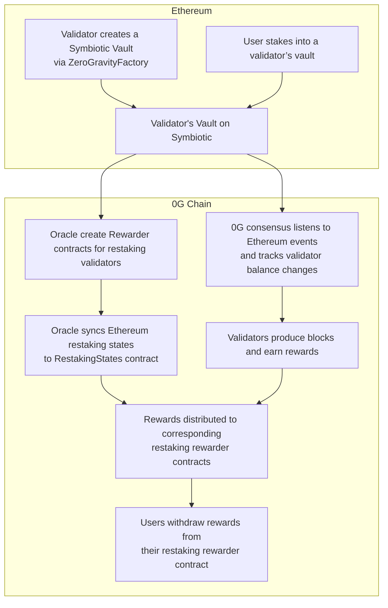

# 0g-restaking-contracts

**0g-restaking-contracts** is part of the **restaking module** for the 0G Chain.  
It is **built on top of the [Symbiotic](https://symbiotic.fi/) protocol**, with the goal of enabling validators to restake their assets in Symbiotic and participate in 0G Chain consensus.  
This design aims to facilitate future scaling and decentralization of the 0G network.

## Overview

The repository consists of **two main components**:

### 1. Ethereum-side Integration Module
This module handles the integration between **0G** and the **Symbiotic protocol**.  
It includes:
- `ZeroGravityFactory`: Create vault / operator / slasher contracts for validators, opt them in the symbiotic protocol and register in 0G middleware.
- `ZeroGravityMiddleware`: 0G middleware integrated with Symbiotic, maintaining supported restaking tokens and voting power weight.

These contracts are **deployed on Ethereum**, enabling 0G validators to restake via Symbiotic.

### 2. 0G Chain Reward Distribution Module
This module is responsible for **distributing block rewards** corresponding to the **restaking portion** of the 0G Chain consensus.  
It includes:
- `RestakingStates`: Maintain the state of restaking-related vaults and other contracts on Ethereum, that are synchronized to the 0G chain by off-chain Oracle. 
- `RewarderFactory`: Deployer of rewarder contracts.
- `Rewarder`: Reward distribution of specific restaking validator.
It is **deployed on the 0G Chain**. 

## Restaking Flow

