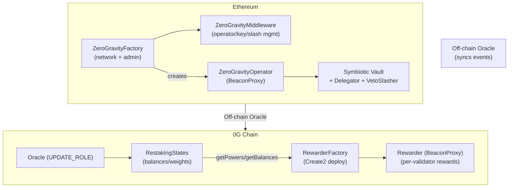

# Architecture

## System Overview

The 0G restaking system spans two chains: **Ethereum** (where restaking assets live via Symbiotic) and the **0G Chain** (where block rewards are distributed). An off-chain oracle bridges state between them.



## Contract Dependency Graph

```mermaid
flowchart TD
    Factory["ZeroGravityFactory"]
    Middleware["ZeroGravityMiddleware"]
    Operator["ZeroGravityOperator"]
    VaultConfig["Symbiotic VaultConfigurator"]
    Create2["Create2Helper"]
    PauseCtrl["PauseControl"]
    SharedVaults["SharedVaults"]
    KeyMgr["KeyManagerBytes"]
    Operators["Operators"]
    TSCapture["TimestampCapture"]
    OzAC["OzAccessControl"]
    WSP["WeightedStakePower"]
    Delegator["IBaseDelegator"]
    VetoSlasher["IVetoSlasher"]
    Rewarder["Rewarder"]
    ReentrancyGuard["ReentrancyGuardUpgradeable"]
    IRestakingStates["IRestakingStates"]
    TransferHelper["TransferHelper"]
    RestakingStates["RestakingStates"]
    ACUpgradeable["AccessControlUpgradeable"]
    IRewarder["IRewarder"]
    RFactory["RewarderFactory"]

    Factory -->|inherits| PauseCtrl
    Factory -->|uses| Operator
    Factory -->|uses| Middleware
    Factory -->|uses| VaultConfig
    Factory -->|uses| Create2

    Middleware -->|inherits| SharedVaults
    Middleware -->|inherits| KeyMgr
    Middleware -->|inherits| Operators
    Middleware -->|inherits| TSCapture
    Middleware -->|inherits| OzAC
    Middleware -->|inherits| WSP
    Middleware -->|uses| Delegator
    Middleware -->|uses| VetoSlasher

    Rewarder -->|inherits| ReentrancyGuard
    Rewarder -->|uses| IRestakingStates
    Rewarder -->|uses| TransferHelper

    RestakingStates -->|inherits| ACUpgradeable
    RestakingStates -->|uses| IRewarder

    RFactory -->|inherits| ACUpgradeable
    RFactory -->|uses| Create2
    RFactory -->|deploys| Rewarder
```



## Storage Layout

All upgradeable contracts use **ERC-7201 namespaced storage** to prevent storage collisions:

| Contract | Namespace | Storage Location |
|----------|-----------|-----------------|
| ZeroGravityFactory | `0g.storage.ZeroGravityFactory` | `0xd34a...5600` |
| ZeroGravityMiddleware | `0g.storage.ZeroGravityMiddleware` | `0xac44...9d00` |
| WeightedStakePower | `0g.storage.WeightedStakePower` | `0x1828...9100` |
| Rewarder | `0g.restaking.Rewarder` | `0xcaab...c900` |
| RestakingStates | `0g.restaking.RestakingStates` | `0x4343...cc00` |
| RewarderFactory | `0g.restaking.RewarderFactory` | `0x3fd9...9b00` |
| AscendRouter | `0g.restaking.AscendRouter` | `0x24b0...7900` |

Storage locations are computed as: `keccak256(abi.encode(uint256(keccak256(namespace)) - 1)) & ~bytes32(uint256(0xff))`

## Proxy and Upgrade Patterns

### BeaconProxy (Operators and Rewarders)

Both `ZeroGravityOperator` and `Rewarder` are deployed as **BeaconProxy** instances:

- All operators share one `UpgradeableBeacon` — upgrading the beacon implementation upgrades all operators at once
- All rewarders share a separate `UpgradeableBeacon` — same upgrade-once pattern
- Operators are deployed with `keccak256(pubkey)` as the Create2 salt in the Factory
- Rewarders are deployed with `keccak256(pubkey)` as the Create2 salt in the RewarderFactory

### Upgradeability

- **Factory and Middleware**: Deployed behind proxies (initialization via `initializer` modifier)
- **RestakingStates**: Deployed behind a proxy (initialization via `initializer` modifier)
- **Operators and Rewarders**: Upgraded collectively via their shared beacon contract

## Access Control Matrix

### ZeroGravityFactory

| Role | Granted To | Can Do |
|------|-----------|--------|
| `DEFAULT_ADMIN_ROLE` | Deployer | `setParams`, `registerNetwork`, `addSatelliteChain`, `updateSatelliteChainParams`, `updateRewarderInitCodeHash` |
| `UPDATE_COLLATERAL_ROLE` | Deployer | `updateCollateralConfig` (whitelist collaterals, set minimum deposits) |
| `PAUSER_ROLE` | Deployer | `pause`, `unpause` |

### ZeroGravityMiddleware

| Role | Granted To | Can Do |
|------|-----------|--------|
| `DEFAULT_ADMIN_ROLE` | Specified in InitParams | Full admin |
| `SLASHER_ROLE` | Assigned by admin | `slash` |
| `REGISTER_OPERATOR_ROLE` | Factory (network) | `registerOperator` |
| `WEIGHT_SET_ROLE` | Assigned by admin | `setCollateralWeight` |

### RestakingStates

| Role | Granted To | Can Do |
|------|-----------|--------|
| `DEFAULT_ADMIN_ROLE` | Deployer | `setDomains`, manage roles |
| `UPDATE_ROLE` | Oracle | `deposit`, `withdraw`, `updateWeight` |

### ZeroGravityOperator

| Role | Granted To | Can Do |
|------|-----------|--------|
| `DEFAULT_ADMIN_ROLE` | Factory | `optIn` |

## Reward Distribution Model

The Rewarder uses an **accumulative reward per share** pattern (similar to MasterChef):

1. **New rewards arrive**: Native ETH is sent to the Rewarder contract (via `receive()`)
2. **`_update()` (global)**: Distributes pending rewards across collateral pools proportionally to their voting power:
   ```
   pendingReward = balance - totalUnclaimedRewards
   For each pool: accRewardPerShare += reward * 1e18 / totalSupply
   ```
3. **`_update(account)`**: Checkpoints an account's unclaimed rewards:
   ```
   reward = (accRewardPerShare - lastAccRewardPerShare[account]) * balance / 1e18
   unclaimedRewards[account] += reward
   ```
4. **`claim(account)`**: Transfers accumulated unclaimed rewards as native ETH

The `RestakingStates` contract calls `Rewarder.update(account, domain, collateral)` **before** any balance change to ensure rewards are correctly checkpointed.

## Slashing Model

Slashing is proportional across all of a validator's vaults and subnetworks:

1. Caller provides `captureTimestamp`, operator `key`, and total `power` to slash
2. Middleware resolves the operator's active vaults and subnetworks at the capture timestamp
3. For each vault/subnetwork pair:
   - Looks up the delegated stake
   - Converts to power using collateral weight
   - Calculates proportional share: `slashAmount = powerToStake(power * vaultPower / totalPower)`
4. Submits each slash request to the VetoSlasher
5. VetoSlasher enforces a veto period before the slash is executed
