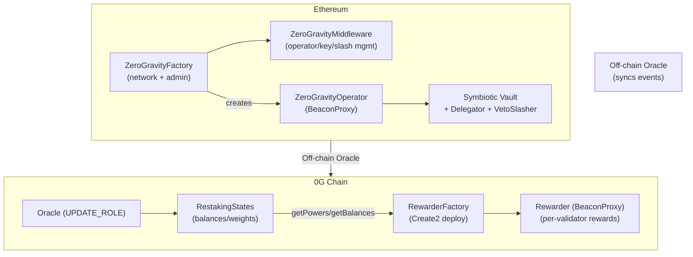

# Architecture

## System Overview

The 0G restaking system spans two chains: **Ethereum** (where restaking assets live via Symbiotic) and the **0G Chain** (where block rewards are distributed). An off-chain oracle bridges state between them.


```mermaid
flowchart TD
    subgraph ETH["Ethereum"]
        Factory["ZeroGravityFactory\n(network + admin)"]
        Middleware["ZeroGravityMiddleware\n(operator/key/slash mgmt)"]
        Operator["ZeroGravityOperator\n(BeaconProxy)"]
        Vault["Symbiotic Vault\n+ Delegator + VetoSlasher"]

        Factory --> Middleware
        Factory -->|creates| Operator
        Operator --> Vault
    end

    Oracle["Off-chain Oracle\n(syncs events)"]

    subgraph ZG["0G Chain"]
        OracleRole["Oracle (UPDATE_ROLE)"]
        States["RestakingStates\n(balances/weights)"]
        RFactory["RewarderFactory\n(Create2 deploy)"]
        Rewarder["Rewarder (BeaconProxy)\n(per-validator rewards)"]

        OracleRole --> States
        States -->|getPowers/getBalances| RFactory
        RFactory --> Rewarder
    end

    ETH -->|Off-chain Oracle| ZG
```

## Contract Dependency Graph


```mermaid
flowchart TD
    Factory["ZeroGravityFactory"]
    Middleware["ZeroGravityMiddleware"]
    Operator["ZeroGravityOperator"]
    VaultConfig["Symbiotic VaultConfigurator"]
    Create2["Create2Helper"]
    PauseCtrl["PauseControl"]
    SharedVaults["SharedVaults"]
    KeyMgr["KeyManagerBytes"]
    Operators["Operators"]
    TSCapture["TimestampCapture"]
    OzAC["OzAccessControl"]
    WSP["WeightedStakePower"]
    Delegator["IBaseDelegator"]
    VetoSlasher["IVetoSlasher"]
    Rewarder["Rewarder"]
    ReentrancyGuard["ReentrancyGuardUpgradeable"]
    IRestakingStates["IRestakingStates"]
    TransferHelper["TransferHelper"]
    RestakingStates["RestakingStates"]
    ACUpgradeable["AccessControlUpgradeable"]
    IRewarder["IRewarder"]
    RFactory["RewarderFactory"]

    Factory -->|inherits| PauseCtrl
    Factory -->|uses| Operator
    Factory -->|uses| Middleware
    Factory -->|uses| VaultConfig
    Factory -->|uses| Create2

    Middleware -->|inherits| SharedVaults
    Middleware -->|inherits| KeyMgr
    Middleware -->|inherits| Operators
    Middleware -->|inherits| TSCapture
    Middleware -->|inherits| OzAC
    Middleware -->|inherits| WSP
    Middleware -->|uses| Delegator
    Middleware -->|uses| VetoSlasher

    Rewarder -->|inherits| ReentrancyGuard
    Rewarder -->|uses| IRestakingStates
    Rewarder -->|uses| TransferHelper

    RestakingStates -->|inherits| ACUpgradeable
    RestakingStates -->|uses| IRewarder

    RFactory -->|inherits| ACUpgradeable
    RFactory -->|uses| Create2
    RFactory -->|deploys| Rewarder
```

## Storage Layout

All upgradeable contracts use **ERC-7201 namespaced storage** to prevent storage collisions:

| Contract | Namespace | Storage Location |
|----------|-----------|-----------------|
| ZeroGravityFactory | `0g.storage.ZeroGravityFactory` | `0xd34a...5600` |
| ZeroGravityMiddleware | `0g.storage.ZeroGravityMiddleware` | `0xac44...9d00` |
| WeightedStakePower | `0g.storage.WeightedStakePower` | `0x1828...9100` |
| Rewarder | `0g.restaking.Rewarder` | `0xcaab...c900` |
| RestakingStates | `0g.restaking.RestakingStates` | `0x4343...cc00` |
| RewarderFactory | `0g.restaking.RewarderFactory` | `0x3fd9...9b00` |
| AscendRouter | `0g.restaking.AscendRouter` | `0x24b0...7900` |

Storage locations are computed as: `keccak256(abi.encode(uint256(keccak256(namespace)) - 1)) & ~bytes32(uint256(0xff))`

## Proxy and Upgrade Patterns

### BeaconProxy (Operators and Rewarders)

Both `ZeroGravityOperator` and `Rewarder` are deployed as **BeaconProxy** instances:

- All operators share one `UpgradeableBeacon` — upgrading the beacon implementation upgrades all operators at once
- All rewarders share a separate `UpgradeableBeacon` — same upgrade-once pattern
- Operators are deployed with `keccak256(pubkey)` as the Create2 salt in the Factory
- Rewarders are deployed with `keccak256(pubkey)` as the Create2 salt in the RewarderFactory

### Upgradeability

- **Factory and Middleware**: Deployed behind proxies (initialization via `initializer` modifier)
- **RestakingStates**: Deployed behind a proxy (initialization via `initializer` modifier)
- **Operators and Rewarders**: Upgraded collectively via their shared beacon contract

## Access Control Matrix

### ZeroGravityFactory

| Role | Granted To | Can Do |
|------|-----------|--------|
| `DEFAULT_ADMIN_ROLE` | Deployer | `setParams`, `registerNetwork`, `addSatelliteChain`, `updateSatelliteChainParams`, `updateRewarderInitCodeHash` |
| `UPDATE_COLLATERAL_ROLE` | Deployer | `updateCollateralConfig` (whitelist collaterals, set minimum deposits) |
| `PAUSER_ROLE` | Deployer | `pause`, `unpause` |

### ZeroGravityMiddleware

| Role | Granted To | Can Do |
|------|-----------|--------|
| `DEFAULT_ADMIN_ROLE` | Specified in InitParams | Full admin |
| `SLASHER_ROLE` | Assigned by admin | `slash` |
| `REGISTER_OPERATOR_ROLE` | Factory (network) | `registerOperator` |
| `WEIGHT_SET_ROLE` | Assigned by admin | `setCollateralWeight` |

### RestakingStates

| Role | Granted To | Can Do |
|------|-----------|--------|
| `DEFAULT_ADMIN_ROLE` | Deployer | `setDomains`, manage roles |
| `UPDATE_ROLE` | Oracle | `deposit`, `withdraw`, `updateWeight` |

### ZeroGravityOperator

| Role | Granted To | Can Do |
|------|-----------|--------|
| `DEFAULT_ADMIN_ROLE` | Factory | `optIn` |

### Governance Handover

The roles above are self-granted to the deploying EOA by the initializers, and every
`UpgradeableBeacon` — the upgrade key for all proxies behind it — is owned by that same EOA.
`script/Ownership.s.sol` moves both classes of key to a multisig, per chain. Every entry point
takes the chain id it is meant for and asserts it, because the deployment records exist for
several 0G chains with identical key names and the two networks share contract addresses.

| Step | 0G chain | Ethereum |
|------|----------|----------|
| 1. Upgrade keys | `transferZgBeacons(chainId, multisig)` | `transferEthBeacons(multisig)` |
| 2. Grant admin | `grantZgAdmins(chainId, multisig)` | `grantEthAdmins(multisig)` |
| 3. Drop deployer | `revokeZgDeployer(chainId, multisig, committer)` | `revokeEthDeployer(multisig)` |

Steps 2 and 3 are separate transactions on purpose, so the grant can be confirmed on chain
before the deployer gives up access. Step 3 refuses to run unless the multisig already holds
`DEFAULT_ADMIN_ROLE`, because revoking the last admin of an `AccessControl` contract cannot be
undone. That check on its own does not catch a mistyped multisig — the same wrong address would
have been granted the role in step 2 and would satisfy it — so every address receiving authority
in these steps must also have contract code. The account being revoked is derived from the
signing key rather than passed in, and `revokeZgDeployer` additionally requires the named
committer to already hold `UPDATE_ROLE`, which is the only on-chain evidence that dropping the
deployer's copy does not strand submissions on a non-enumerable contract.

The operational roles are deliberately left in place: `UPDATE_ROLE` belongs to the committer hot
key, `DISTRIBUTOR_ROLE` to the distributor bot, and `REGISTER_OPERATOR_ROLE` to the factory
contract itself — a multisig cannot serve any of the three. `grantRoleTo` / `revokeRoleFrom` /
`transferBeacon` cover single-target corrections, such as rotating the committer key or keeping a
fast hot `PAUSER_ROLE` alongside the multisig, and accept an EOA for exactly that reason.

**Not covered: the VetoSlasher resolver.** `createValidator` sets each new vault's veto resolver
to the address in `InitParams.resolver`, which the deployment scripts set to the deploying EOA.
That resolver can veto any slash within the veto window. `VetoSlasher.setResolver` only accepts
calls from the registered network — the factory — and no factory selector calls it, so existing
vaults keep their current resolver no matter what the handover does; `setParams` only changes the
resolver handed to vaults created later, and a resolver change takes `resolverSetEpochsDelay`
vault epochs to take effect. Moving it therefore requires a factory upgrade that exposes a
resolver setter. Until then the veto path stays with the deploying EOA, and the handover should
not be described as complete.

## Reward Distribution Model

The Rewarder uses an **accumulative reward per share** pattern (similar to MasterChef):

1. **New rewards arrive**: Native ETH is sent to the Rewarder contract (via `receive()`)
2. **`_update()` (global)**: Distributes pending rewards across collateral pools proportionally to their voting power:
   ```
   pendingReward = balance - totalUnclaimedRewards
   For each pool: accRewardPerShare += reward * 1e18 / totalSupply
   ```
3. **`_update(account)`**: Checkpoints an account's unclaimed rewards:
   ```
   reward = (accRewardPerShare - lastAccRewardPerShare[account]) * balance / 1e18
   unclaimedRewards[account] += reward
   ```
4. **`claim(account)`**: Transfers accumulated unclaimed rewards as native ETH

The `RestakingStates` contract calls `Rewarder.update(account, domain, collateral)` **before** any balance change to ensure rewards are correctly checkpointed.

## Slashing Model

Slashing is proportional across all of a validator's vaults and subnetworks:

1. Caller provides `captureTimestamp`, operator `key`, and total `power` to slash
2. Middleware resolves the operator's active vaults and subnetworks at the capture timestamp
3. For each vault/subnetwork pair:
   - Looks up the delegated stake
   - Converts to power using collateral weight
   - Calculates proportional share: `slashAmount = powerToStake(power * vaultPower / totalPower)`
4. Submits each slash request to the VetoSlasher
5. VetoSlasher enforces a veto period before the slash is executed
